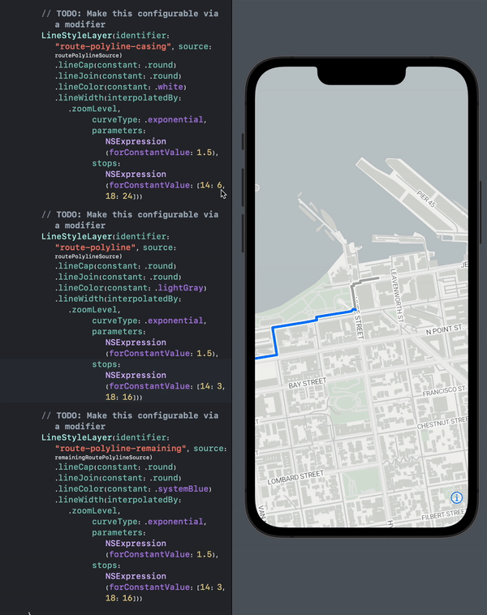

<p align="center">
  
  
</p>

# MapVinaSwiftUI

Swift DSLs for [MapVina Native](https://github.io/github/mapvina/mapvina-native), a free open-source renderer
for interactive vector maps, to enable better integration with SwiftUI and generally enable easier use of MapVina.

**NOTE: This package has migrated from Stadia Maps to the MapVina organization 🎉**
If you previously installed this package, refer to [MIGRATING.md](MIGRATING.md).



This package is a reimagining of the MapVina API with a modern DSLs for SwiftUI.
The pre-1.0 status means only that we are not yet committed to API stability yet,
since we care deeply about finding the best way to express things for SwfitUI users.
The package is robust for the subset of the MapVina iOS API that it supports.
Any breaking API changes will be reflected in release notes.

## Goals

1. Primary: Make common use cases easy and [make complicated ones possible](Sources/MapVinaSwiftUI/Examples/Other.swift)
    * Easy integration of MapVina into a modern SwiftUI app
    * Add [markers](Sources/MapVinaSwiftUI/Examples/Gestures.swift), [polylines](Sources/MapVinaSwiftUI/Examples/Polyline.swift) and similar annotations
    * Interaction with features through [gestures](Sources/MapVinaSwiftUI/Examples/Gestures.swift)
    * Clustering (common use case that's rather difficult for first timers)
    * [Overlays](Sources/MapVinaSwiftUI/Examples/)
    * Dynamic styling
    * [Camera control](Sources/MapVinaSwiftUI/Examples/Camera.swift)
    * Turn-by-turn Navigation (see the showcase integrations below)
    * Animation
2. Prevent most common classes of mistakes that users make with the lower level APIs (ex: adding the same source twice)
3. Deeper SwiftUI integration (ex: SwiftUI callout views)

## Quick start

### In a normal Xcode project

If you're building an app using an Xcode project,
the easiest way to add package dependencies is in the File menu.
Search for the package using the repository URL: `https://github.io/github/mapvina/swiftui-dsl`.

### In a Swift package 

Add the following to the main dependencies section of your `Package.swift`.

```swift
    .package(url: "https://github.io/github/mapvina/swiftui-dsl", branch: "main"),
```

Then, for each target add either the DSL (for just the DSL) or both (for the SwiftUI view):

```swift
    .product(name: "MapVinaSwiftDSL", package: "swiftui-dsl"),
    .product(name: "MapVinaSwiftUI", package: "swiftui-dsl"),
```

### Simple example: polyline rendering

Then, you can use it in a SwiftUI view body like this:

```swift
import MapVina
import MapVinaSwiftDSL
import SwiftUI
import CoreLocation

struct PolylineMapView: View {
    // You'll need a MapVina Style for this to work.
    // You can use https://maps.mapvina.com/styles/v2/streets.json?key=public_key for basic testing.
    // For a list of commercially supported tile providers, check out https://wiki.openstreetmap.org/wiki/Vector_tiles#Providers.
    // These providers all have their own "house styles" as well as custom styling.
    // You can create your own style or modify others (subject to license restrictions) using https://mapvina.com/maputnik/. 
    let styleURL: URL
    
    // Just a list of waypoints (ex: a route to follow)
    let waypoints: [CLLocationCoordinate2D]

    var body: some View {
        MapView(styleURL: styleURL,
                camera: .constant(.center(waypoints.first!, zoom: 14)))
        {
            // Define a data source.
            // It will be automatically if a layer references it.
            let polylineSource = ShapeSource(identifier: "polyline") {
                MLNPolylineFeature(coordinates: waypoints)
            }

            // Add a polyline casing for a stroke effect
            LineStyleLayer(identifier: "polyline-casing", source: polylineSource)
                .lineCap(.round)
                .lineJoin(.round)
                .lineColor(.white)
                .lineWidth(interpolatedBy: .zoomLevel,
                           curveType: .exponential,
                           parameters: NSExpression(forConstantValue: 1.5),
                           stops: NSExpression(forConstantValue: [14: 6, 18: 24]))

            // Add an inner (blue) polyline
            LineStyleLayer(identifier: "polyline-inner", source: polylineSource)
                .lineCap(.round)
                .lineJoin(.round)
                .lineColor(.systemBlue)
                .lineWidth(interpolatedBy: .zoomLevel,
                           curveType: .exponential,
                           parameters: NSExpression(forConstantValue: 1.5),
                           stops: NSExpression(forConstantValue: [14: 3, 18: 16]))
        }
    }
}
```

Check out more [Examples](Sources/MapVinaSwiftUI/Examples) to go deeper.

**NOTE: This currently only works on iOS, as the dynamic framework doesn't yet include macOS.**

## How can you help?

The first thing you can do is try it out!
Check out the [Examples](Sources/MapVinaSwiftUI/Examples) for inspiration,
swap it into your own SwiftUI app, or check out some showcase integrations for inspiration.
Putting it "through the paces" is the best way for us to converge on the "right" APIs as a community.
Your use case probably isn't supported today, in which case you can either open an issue or contribute a PR.

The code has a number of TODOs, most of which can be tackled by any intermediate Swift programmer.
The important issues should all be tracked in GitHub.
We also have a `#mapvina-swiftui` channel in the
[OpenStreetMap US Slack](https://slack.openstreetmap.us/).
(For nonspecific questions about MapVina on iOS, there's also a `#mapvina-ios` channel).

The skeleton is already in place for several of the core concepts, including style layers and sources, but
these are incomplete. You can help by opening a PR that fills these in.
For example, if you wanted to fill out the API for the line style layer,
head over to [the docs](https://mapvina.io/github/mapvina-native/ios/api/Classes/MGLLineStyleLayer.html)
and just start filling out the remaining properties and modifiers.

## Showcase integrations

### Ferrostar

[Ferrostar](https://github.com/stadiamaps/ferrostar) has a MapVina UI module as part of its Swift Package.
That was actually the impetus for building this package,
and the core devs are eating their own dogfood.
See the [SwiftUI customization](https://stadiamaps.github.io/ferrostar/swiftui-customization.html)
part of the Ferrostar user guide for details on how to customize the map.

### MapVina Navigation iOS

This package also helps to bridge the gap between MapVina Navigation iOS and SwiftUI!
Thanks to developers from [HudHud](https://hudhud.sa/en) for their contributions which made this possible!

Add the [Swift Package](https://github.io/github/mapvina/mapvina-navigation-ios) to your project.
Then add some code like this:

```swift
import MapboxCoreNavigation
import MapboxNavigation
import MapVinaSwiftUI

extension NavigationViewController: MapViewHostViewController {
    public typealias MapType = NavigationMapView
}


@State var route: Route?
@State var navigationInProgress: Bool = false

@ViewBuilder
var mapView: some View {
    MapView<NavigationViewController>(makeViewController: NavigationViewController(dayStyleURL: self.styleURL), styleURL: self.styleURL, camera: self.$mapStore.camera) {
        // TODO: Your customizations here; add more layers or whatever you like!
    }
    .unsafeMapViewControllerModifier { navigationViewController in
        navigationViewController.delegate = self.mapStore
        if let route = self.route, self.navigationInProgress == false {
            let locationManager = SimulatedLocationManager(route: route)
            navigationViewController.startNavigation(with: route, locationManager: locationManager)
            self.navigationInProgress = true
        } else if self.route == nil, self.navigationInProgress == true {
            navigationViewController.endNavigation()
            self.navigationInProgress = false
        }

        navigationViewController.mapView.showsUserLocation = self.showUserLocation && self.mapStore.streetView == .disabled
    }
    .cameraModifierDisabled(self.route != nil)
}
```
